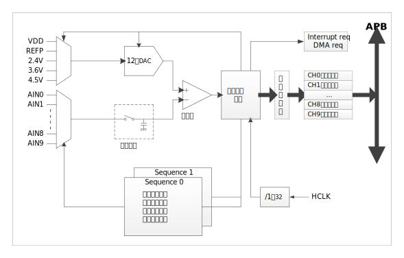

模块结构
^^^^^^^^^^^^^^^^^^^^^^^

:numref:`ADC结构框图` 为ADC结构框图。

.. _ADC结构框图:

   ADC结构框图

功能描述
~~~~~~~~

序列
^^^^

序列用于为一组通道设定转换配置，例如SEQ0CHN
设定序列SEQ0中包含哪些通道、这些通道的转换顺序，SMPTIM设定这组通道的采样时间，SMPNUM设定这组通道的转换次数（序列中所有通道全部完成转换算一次），SEQTRG设定这组通道的触发信号。

SEQTRG选中的触发信号出现时，SEQxCHN中选中的通道依次完成转换，所有选中通道全部完成转换后，若SMPNUM=1，则序列转换停止，等待下一个触发信号；若SMPNUM>1，则自动再次执行一遍SEQxCHN中选中的通道的转换，此过程一直重复SMPNUM次。

使用序列为一组通道设定转换配置，避免了为这组通道中每个通道单独设定一遍转换配置（触发信号、采样时间、转换次数等），简化了繁琐、重复的配置步骤。

转换通道选择
^^^^^^^^^^^^

通过寄存器SEQ0CHN、SEQ1CHN可以分别为序列0和序列1指定最多8个通道，当序列被启动后，8个通道依次转换。

例如，想要指定序列0启动后，依次转换通道0、2、1，可如下设置寄存器SEQ0CHN：

.. _ADC通道选择_1:

寄存器SEQ0CHN的最低4位（SEQ0CHN[3:0]）写入0，SEQ0CHN[7:4]写入2，SEQ0CHN[11:8]写入1，SEQ0CHN[15:12]写入15。通道号15是序列转换通道终止标记，用于当需要转换的通道个数少于8个时，标记需转换通道的个数。

通过此示例可以发现，通道的转换顺序不受物理通道号的限制，可以先转换通道2、后转换通道1。不仅如此，在一次序列启动中，单个通道可以转换不止一次。如下配置所示：

.. _ADC通道选择_2:

此配置中，通道0转换一次，然后通道2转换两次，最后通道1转换一次。

硬件取平均
^^^^^^^^^^

SAR ADC 支持针对采样数据硬件自动完成平均值计算。通过配置 CR 寄存器中 AVG
位设置为结果取平均。支持 2 到 8 次取平均。设置 N 次平均，则采集完成 N
次后 EOC 标志有效，同时取平均值的结果被送至对应通道数据寄存器。

转换结果比较
^^^^^^^^^^^^

ADC支持序列转换结果与指定值比较，当SEQ0中通道的转换结果大于SEQ0CHK.MAX设定值，或小于SEQ0CHK.MIN设定值时，可分别产生IF.SEQ0MAX和IF.SEQ0MIN中断请求。此功能可用于监控指定通道的转换结果，实现类似模拟比较器的功能。

中断处理
^^^^^^^^

ADC中每个序列均支持EOC、MAX、MIN三个中断，三个中断在均可独立使能、关闭、查询和清除。三个中断相或向内核产生中断请求：

.. _ADC中断请求:

   ADC 中断请求

