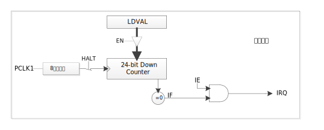
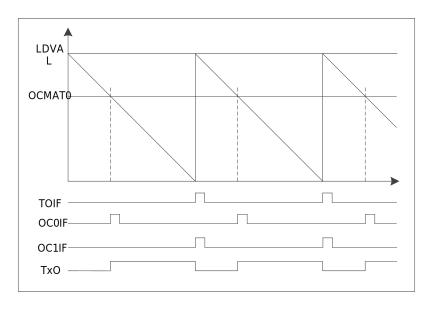

模块结构
^^^^^^^^^^^^^^^^

.. _BTIMER模块结构框图:

   BTIMER模块结构框图

.. 功能描述**
.. -----------------

.. 使用BTIMERx作为定时器时，为递减计数，计数源为系统时钟。

定时器
^^^^^^^^^^

使用流程如下:

-  通过预分频寄存器（PREDIVx）设置预分频目标值(8位)，对系统时钟进行分频。

-  通过装载值寄存器（LOADx）设置计数目标值(24位)。

-  通过中断使能寄存器（IEx）配置中断使能。

-  通过使能寄存器（EN）进行对应BTIMERx使能。

-  对应BTIMERx开始递减计数，计数到0时，产生中断，同时重新从装载值寄存器（LOADx）装载计数值，进行下一周期计数。

-  中断通过中断状态寄存器（IFx）进行查询（IEx使能情况下），同时对该寄存器进行写1操作清除中断

-  在计数过程中，可通过对当前值寄存器（VALUEx）进行读取，获取当前计数值。

-  定时器计数过程中改变装载值寄存器（LOADx）值，同时向装载位（RELOAD）写1，BTIMER将立刻重新装载改变值并计数（RELAOD位硬件自动清0），当前计数周期被中断。若不对装载位（RELOAD）进行操作，则改变值将在下个计数周期（计数到0重新装载）生效，不会改变本周期计数值。

如 :numref:`定时器工作示意图`，:numref:`定时器RELOAD工作示意图` 所示。

.. _定时器工作示意图:

   定时器工作示意图
   

.. _定时器RELOAD工作示意图:

   定时器RELOAD工作示意图

脉冲发送
^^^^^^^^^^

所有TIMER模块均支持脉冲发送功能，可发送指定脉宽的方波。该计数器为向下计数。使用方式如下：

-  针对外部信号输入引脚进行如下操作

   -  配置PORTCON模块中使能引脚输出功能

   -  通过PORTX_FUNC寄存器将引脚切换为TIMER对应数字功能

-  TIMER初始化

   -  指定要被设置的定时器

   -  设置TIMER的工作模式为OC(输出比较)模式

   -  设置定时周期

   -  输出比较功能初始化

   -  指定要被设置的定时器

   -  设置当计数器的值递减到MATCH时引脚输出电平翻转

   -  设置初始输出电平

-  启动定时器

-  每次周期结束时，会更新翻转电平配置

示意图如 :numref:`脉冲发送示意图` 所示：

.. _脉冲发送示意图:

   脉冲发送示意图

中断配置与清除
^^^^^^^^^^^^^^^^^^

每路TIMER均具备独立中断，通过中断使能寄存器IE进行各TIMER中断使能。通过中断状态寄存器IF进行中断查询及清除。

可通过配置中断使能寄存器IEx使能中断。当TIMER计数到0时，中断标志寄存器IFx置1。如需清除此标志，需在标志位中写1清零（R/W1C），否则中断在开启状态下会一直进入。

