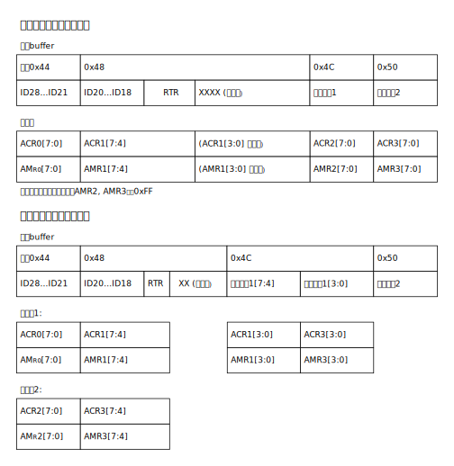
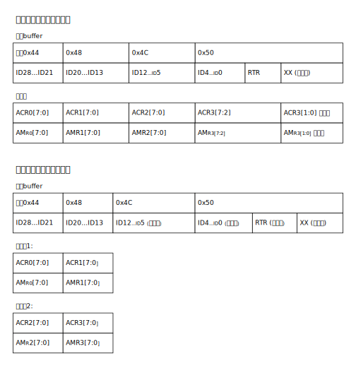

中断配置与清除
^^^^^^^^^^^^^^^^

CAN模块支持如下中断：

-  接收中断

-  发送中断

-  错误中断

-  数据溢出中断

-  唤醒中断

-  被动错误中断

-  仲裁丢失中断

-  总线错误中断

触发中断前，首先需要设置相应位的中断使能(IE)。

各中断状态清除(除接收中断)，均为读清除。对于接收中断，需要将CMD寄存器RRB位写1清除。

数据发送
^^^^^^^^

发送报文需要设置发送buffer
(寄存器INFO，DATA0—DATA11)。可以是标准帧格式或是扩展帧格式。数据位最大是8个字节，超过8字节，自动按8字节计算。

写数据前，需要查看SR寄存器TXRDY位是否等于1，如果不等于1，则发送的数据将会被丢弃。发送数据请求通过设置CMD寄存器TXREQ位为1(发送请求)
或是CMD.
SRR=1(自接收请求)。发送传输启动时，状态寄存器SR.TXBUSY置1，发送请求位清零。

数据传输没有开始时，可以通过设置命令寄存器(CMD. ABTTX = 1)中止传输。如果已经开始传输，则不能中止。

数据接收
^^^^^^^^

数据接收先通过滤波器，符合条件标识符的才可以接收。滤波器的设置详见“接收滤波”章节。

数据接收可以读取内部128字节FIFO。

当CAN模块开始将接收到的数据写入接收FIFO时，状态寄存器SR.RXBUSY = 1，
当接收FIFO (寄存器INFO，DATA0—DATA11)接收到完整报文的时候，状态寄存器SR. RXDA = 1,
中断状态IF.RXDA置1(如果中断使能寄存器IE.RXDA置1)。
接收FIFO是64字节，最多允许接收5个完整的扩展帧报文。如果接收FIFO没有足够的内存，状态寄存器SR.RXOV = 1，数据溢出，
(如果中断使能 IE. RXOV =1)，溢出中断置位IF.RXOV = 1。

从接收FIFO中读取数据后，需要释放FIFO(设置CMD. RRB = 1)。如果没有读取的数据，中断状态位(IE. RXDA)和接收BUFFER(SR.RXDA)状态位清除。

自接收
^^^^^^

自接收功能，数据可以自发自收，不发送应答位。通过设置自接收请求(CMD. SRR = 1),根据配置，可以产生发送和接收中断。

如果自接收请求和发送请求同时设置，则自接收请求设置无效

接收滤波
^^^^^^^^

验收滤波器有验收代码寄存器(ACR0—ACR3)和验收屏蔽寄存器(AMR0—AMR1)

当接收到的CAN帧的ID满足ACR & ~AMR == ID & ~AMR时，该帧通过过滤，否则丢弃该帧。

  

波特率
^^^^^^

可通过BT0
和BT1寄存器设置波特率，波特率的分频值（BRP）低6bit存入BT0寄存器BRP位，高4bit存入BT2寄存器BRP位。

如 BRP = (SystemCoreClock / 2) / 2 / Baudrate/(1 + (BT1.TSEG1+ 1) + (BT1.TSEG2 + 1)) – 1

值得注意的是需要确保BRP的值为整数，即(SystemCoreClock / 2) / 2 / Baudrate 为整数，
即(1 + (BT1.TSEG1+ 1) + (BT1.TSEG2 + 1))能被((SystemCoreClock / 2) / 2 / Baudrate)整除。

采样点 = (BT1.TSEG1 + 1)/((1 + (BT1.TSEG1 + 1) + (BT1.TSEG2 + 1)) * 100%

如 :numref:`ref_can_baudrate` 波特率设置示意图所示。

.. _ref_can_baudrate:

   波特率设置示意图
   

错误处理
^^^^^^^^

CAN
模块包括两个错误计数器：接收错误计数器RXERR和发送错误计数器TXERR。当发生错误时，它们会根据
CAN 2.0 规范自动递增。

错误的类型（位错误、格式错误、填充错误或是其他错误）和错误在帧中的位置，可以通过错误代码捕捉寄存器ECC查询。

错误报警限制寄存器EWLIM用于设定当接收/发送错误个数达到指定值时触发警告，默认值是96。当发送错误计数器或是接收错误计数器超过错误报警限制寄存器设置的值时，错误状态寄存器(SR.
ERRWARN = 1)置1，如果错误中断使能(IE. ERRWARN = 1)，产生错误中断(IF.
ERRWARN = 1)。

如果任何一个错误计数器超过127时，CAN进入错误被动状态（Error
Passive），如果主动错误中断使能(IE. ERRPASS = 1)，产生错误主动中断(IF.
ERRPASS = 1)。

如果发送错误计数器超过了255，总线状态位(SR.
BUSOFF)会被置1，总线关闭，CAN就会进入复位模式。当清除控制寄存器的复位模式(CR.
RST)，CAN退出复位模式。

睡眠模式
^^^^^^^^

CAN可以工作在低功耗的睡眠模式。通过设置控制寄存器CR.SLEEP =
1，进入睡眠模式。

唤醒睡眠模式可以通过以下三种：

-  总线上有活动

-  配置睡眠中断使能，触发睡眠唤醒中断

-  清除睡眠位（CR.SLEEP =0）

如果是总线上有活动唤醒睡眠模式，CAN
直到检测到总线空闲，并且接收到11bit后，才接受报文。在复位模式下，CAN不能进入睡眠模式。

仅听模式
^^^^^^^^

配置CR. LOM = 1，进入仅听模式。（至少需要三个节点）。

CAN工作在仅听模式，只接收数据，不发送数据。即使接收成功，也不发送应答位。

初始化和配置
^^^^^^^^^^^^

初始化

-  配置中断使能寄存器

-  选择单/双过滤模式和复位模式

-  配置验收寄存器(ACR0—ACR3) 和验收屏蔽寄存器(AMR0—AMR3)

-  配置总线定时寄存器0(BTR0)和1(BTR1),设置波特率

-  配置CR寄存器，退出复位模式

设置发送数据

-  查看发送buffer状态位，SR. TXBR

-  如果可以写入新的报文发送，在发送buffer中写入数据
   (配置寄存器INFO，DATA0—DATA11)

-  配置命令寄存器CMD，设置CMD. TXREQ，发送数据请求，或CMD.
   SRR，自接收请求

-  设置接收数据

-  查看接收中断状态IF. RXDA (使能接收中断)或是接收buffer状态寄存器SR.
   RXDA

-  当读取接收buffer里的数据后(寄存器INFO，DATA0—DATA11)，将CMD.
   RRB置1，释放接收FIFO。

  

