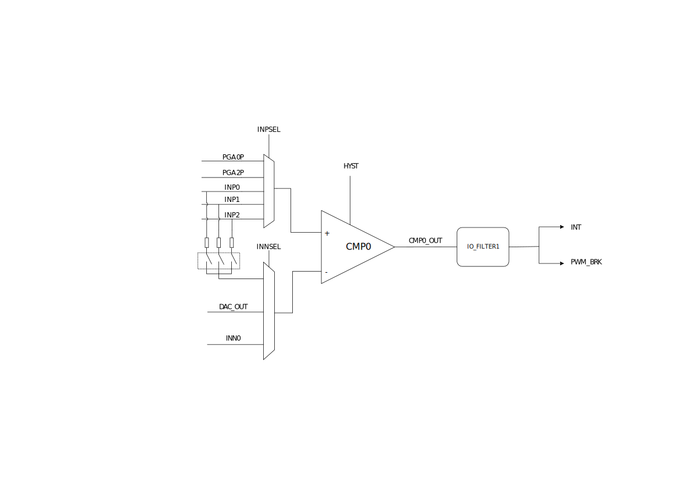
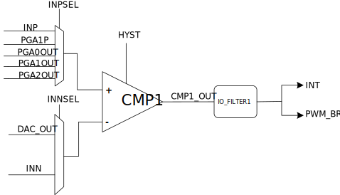

模块结构
^^^^^^^^^^^
CMP0 结构框图如 :numref:`CMP0模块结构框图` 所示。

.. _CMP0模块结构框图:

   CMP0模块结构框图

CMP1 结构框图如 :numref:`CMP1模块结构框图` 所示。

.. _CMP1模块结构框图:

   CMP1模块结构框图

本芯片有2个比较器，其中CMP0拥有3个正端输入IO口，当其正端输入（INP）大于负端输入（INN）时，结果为逻辑1，反之则为逻辑0；

每一路比较器的输出经过数字滤波可配置为：

-  PWM的输入刹车使能

-  CMP翻转中断

在以上两种输出中，比较器CMPx的结果不会直接输出，可以通过读取ACMPSR寄存器的CMPxOUT位查询原始输出状态。

例如，在使用比较器CMP0时，将相应管脚复用为比较器端口，比较器CMP0的输出结果可在寄存器ACMPSR中的CMP0OUT读取。如果在ACMPCR中配置了CMP0的中断使能，比较器0的输出变化会触发中断，中断状态可在ACMPSR中的CMP0IF位查看。

CMP0、CMP1同时支持负端连接内部8位DAC，但此路DAC有且仅有一个值，可通过ACMPCR寄存器的DACDR位设置。

比较器配置

-  配置需使用的比较器管脚使其切换为模拟信号模式，比较器的正端输入引脚和负端输入引脚都需要切换为模拟功能模式

-  配置输入引脚的中断使能（ACMPxCR.
   IE），可配置为不产生中断，也可配置为当比较器输出有变化（包括从0到1和从1到0）时产生引脚中断

-  配置CMP迟滞是否开启（ACMPxCR. HYST）

-  配置CMPx使能寄存器（ACMPxCR.EN），使能CMP

-  在ACMPSR中查看比较器输出结果和中断状态

迟滞
^^^^

带有迟滞比较的输出模式有无，10mV，20mV或50mV迟滞。比较器迟滞电压模块可通过ACMPCR寄存器CMPxHYS位配置。

在迟滞比较的输出模式下，迟滞电压与输出电平反向。当输入信号过零后，输出信号跳转，控制迟滞电压极性，使得输入信号远离过零点，避免输入噪声造成比较器的输出跳变。

其示意图如 :numref:`ref_cmp_Hyst` 所示：

.. _ref_cmp_Hyst:

   比较器迟滞功能示意图

比较器滤波
^^^^^^^^^^

此外，比较器的输出端内置filter1软件滤波。

.. _ref_cmp_FILTER1:

   比较器与FILTER1关系

如 :numref:`ref_cmp_FILTER1` 所示，FILTER1输出的信号连接至PWM刹车及中断，其最终状态可能与输出至PWM刹车及中断的状态不一致。

如 :numref:`ref_cmp_FILTER1wave` 所示：

.. _ref_cmp_FILTER1wave:

   比较器FILTER1滤波波形

中断配置与清除
^^^^^^^^^^^^^^

比较器支持中断标志变化中断，标志变化包括从0到1和从1到0，此中断写1清零。