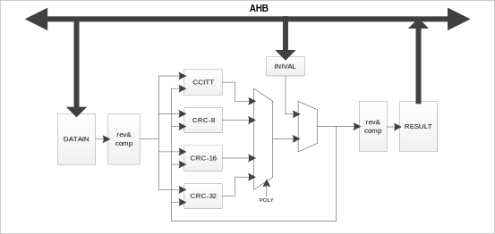

模块结构
^^^^^^^^^^^^^^

CRC循环冗余检验结构如 :numref:`CRC结构框图` 所示：

.. _CRC结构框图:

   CRC结构框图

功能描述
~~~~~~~~

计算步骤
^^^^^^^^

-  根据需求，通过CR寄存器选择CRC算法、输入数据有效位宽、输出结果

-  根据需求，通过INIVAL寄存器设置CRC初始值

-  通过CR寄存器使能CRC计算

-  通过DATAIN寄存器向CRC计算单元输入要计算的数据

-  通过RESULT寄存器读取计算结果

计算步骤
^^^^^^^^

-  根据需求，通过CR寄存器选择CRC算法、输入数据有效位宽、输出结果

-  根据需求，通过INIVAL寄存器设置CRC初始值

-  通过CR寄存器使能CRC计算

-  通过DATAIN寄存器向CRC计算单元输入要计算的数据

-  通过RESULT寄存器读取计算结果

