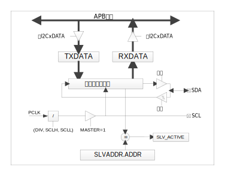
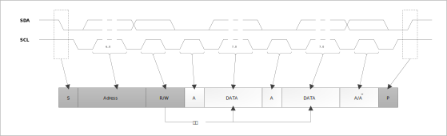
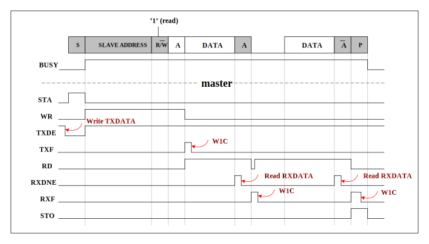
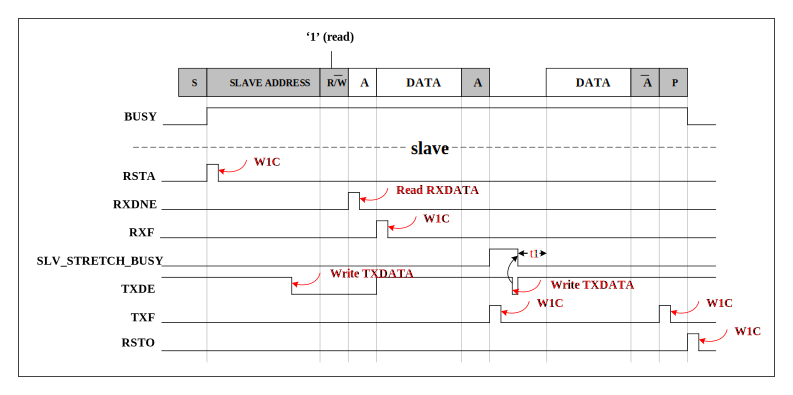

模块结构
^^^^^^^^^^^
I2C 模块结构如 :numref:`I2C模块结构框图` 所示。

.. _I2C模块结构框图:

   I2C 模块结构宽图

基本操作
^^^^^^^^

**总线设置**

I2C总线采用串行数据线（SDA）和串行时钟线（SCL）传输数据。I2C 总线的设备端口为开漏输出，必须在接口外接上拉电阻。

数据在主从设备之间通过 SCL 时钟信号在 SDA 数据线上逐字节同步传输。每一个 SCL 时钟脉冲发送一位数据，高位在前。每发送一个字节的数据产生一个应答信号。在时钟线 SCL 高电平期间对数据的每一位进行采样。数据线 SDA 在时钟线 SCL 为低改变，在时钟线 SCL 为高电平时保持稳定。

**协议介绍**

通常情况下，一个标准的通信包含四个部分：开始信号、从机地址、数据传输、停止信号。如 :numref:`ref_i2c_communication` 所示：

.. _ref_i2c_communication:

   I2C 通信示意图
   
**起始位发送**

当总线空闲时，表示没有主机设备占用总线（SCL 和 SDA 都保持高电平），主机可以通过发送一个起始信号启动传输。启动信号，通常被称为 S 位。SCL 为高电平时，SDA 由高电平向低电平跳变。启动信号表示开始新的数据传输。

重新启动是没有先产生一个停止信号的启动信号。主机使用此方法与另一个从机或者在不释放总线的情况下与相同的从机改变数据传输方向（例如从写入设备到写入设备的转换）。

当命令寄存器的 STA 位被置位，同时 RD 或者 WR 位被置位时，系统核心产生一个启动信号。根据 SCLK 的当前的不同状态，生成启动信号或重复启动信号。

**地址发送**

在开始信号后，由主机传输的第一个字节数据是从机地址。包含7位的从设备地址和1位的RW指示位。RW 指示位信号表示与从机的数据传输方向。在系统中的从机不可以具有相同的地址。只有从机地址和主机发送的地址匹配时才能产生一个应答位（在第九个时钟周期拉低SDA）进行响应。对于10位从机地址，模块通过产生两个从机地址支持。

发送从机地址为一次写操作，在传输寄存器中保存从机地址并对 WR 位置位，从机地址将被发送到总线上。

**数据发送**

一旦成功取得了从机地址，主机就可以通过 R/W 位控制逐字节的发送数据。每传输一个字节都需要在第九个时钟周期产生一个应答位。

如果从机信号无效，主机可以生成一个停止信号中止数据传输或生成重复启动的信号并开始一个新的传输周期。如果从机返回一个 NACK 信号，主机就会产生一个停止信号放弃数据传输，或者产生一个重新启动信号开始一个新的传输周期。

如果主机作为接收设备，没有应答从机，从机就会释放SDA，主机产生停止信号或者重新启动信号。

向从机写入数据，需把将要发送的数据存入传输寄存器中并设置 WR 位。从从机中读取数据，需设置 RD 位。在数据传输过程中系统核心设置 TIP 提示标志，指示传输正在进行。当传输完成后 TIP 提示标志会自动清除。当中断使能时，中断标志位 IF 被置位，并产生中断。当中断标志位 IF 被置位后，接收寄存器收到有效数据。当 TIP 提示标志复位后，用户可以发出新的写入或读取命令。

**停止位发送**

主机可以通过生成一个停止信号终止通信。停止信号通常被称为 P 位，被定义为 SCL 为高电平时，SDA 由低电平向高电平跳变。

Master SCL周期配置
^^^^^^^^^^^^^^^^^^

   Master SCL 周期配置示意图

主机发送模式
^^^^^^^^^^^^

I2C 模块作为主机，初始化配置操作如下：

#.  配置 PORTCON 模块中端口对应 PORTx_FUNC 寄存器，将指定引脚切换为功能复用

#.  配置 PORTCON 模块中端口对应 PULLU_x 上拉使能寄存器，使能端口内部上拉电阻（也可使用外部上拉电阻）

#.  配置 PORTCON 模块中端口对应 INEN_x 输入使能寄存器，使能 I2C 数据线输入功能

#.  配置 CR 寄存器的 EN 位，关闭 I2C 模块，确保配置寄存器过程中模块未工作

#.  配置 CR 寄存器的 MASTER 位，将 I2C 模块设置为主机模式

#.  配置 CR 寄存器的 EN 位，I2C 模块总线使能

#.  设置时序配置寄存器 CLK，假设 PCLK = 48MHz，希望 I2C 工作在 Standard-mode（100kbps）速度下，则每个SCL = 480个PCLK，可以设置 SCLL = 0XA0，SCLH = 0x50，DIV = 0x01

#.  查询 SR.BUSY，如果为1，则等待直至其变为0；如果为0，则进行下一步

#.  发送Start。设置 MCR.STA=1，查询该位，直至其变为0

#.  发 Slave 地址字节

    -  设置 TXDATA 为【7位slave地址字节左移一位】

    -  设置 MCR.WR = 1，查询该位，直至其变为0（或查询到 IF 的 TXDONE = 1（发送成功）或 AL = 1（仲裁丢失总线），并写1清除）

    -  如果 TXDONE = 1，读 TR.RXACK，如果该位为0，表示 Slave 地址匹配成功

    -  如果 AL = 1，表示本 Master 失去总线，不能再进行后续操作，需重新查询 SR.BUSY 位直至1，才可以重新发送 Start 位，重新申请总线操作

#.  向 Slave 发送待写数据

    -  设置 TXDATA，准备待写入 Slave 的数据

    -  设置 MCR.WR = 1，查询该位，直至其变为0（或查询到 RIST 的 TXDONE = 1，并写1清除）

    -  读 TR.RXACK，如果该位为0，表示写数据成功

#.  发 Stop。设置MCR.STO=1，查询该位，直至其变为0

示意图如 :numref:`ref_i2c_master_register_timewave` 所示：

.. _ref_i2c_master_register_timewave:

   Master 寄存器时序示意图

.. attention:: 图中红色部分表示软件操作

主机接收模式
^^^^^^^^^^^^

I2C 作为主机接收模式，需将 I2C 模块设置为 MASTER，初始化过程与主发送模式相同。

I2C 作为主机从从机接收数据操作流程如下：

#.  配置 PORTCON 模块中端口对应 PORTx_FUNC 寄存器，将指定引脚切换为功能复用

#.  配置 PORTCON 模块中端口对应 PULLU_x 上拉使能寄存器，使能端口内部上拉电阻（也可使用外部上拉电阻）

#.  配置 PORTCON 模块中端口对应 INEN_x 输入使能寄存器，使能 I2C 数据线输入功能

#.  配置 CR 寄存器的 EN 位，关闭 I2C 模块，确保配置寄存器过程中模块未工作

#.  配置 CR 寄存器的 MASTER 位，将 I2C 模块设置为主机模式

#.  配置 CR 寄存器的 EN 位，I2C 模块总线使能

#.  设置时序配置寄存器 CLK，假设 PCLK = 48MHz，希望 I2C 工作在 Standard-mode（100kbps）速度下，则每个 SCL = 480个PCLK，可以设置 SCLL = 0XA0，SCLH = 0x50，DIV = 0x01

#.  查询 SR.BUSY，如果为1，则等待直至其变为0；如果为0，则进行下一步

#.  发送 Start。设置 MCR.STA = 1，查询该位，直至其变为0

#.  发 Slave 地址字节

    -  设置 TXDATA为 [ 7位 Slave 地址字节地址右移1位 ]

    -  设置 MCR.WR = 1，查询该位，直至其变为0（或查询到 IF 的 TXDONE = 1（发送成功）或 AL = 1（仲裁丢失总线），并写1清除）
  
    -  如果 TXDONE = 1，读 TR.RXACK，如果该位为0，表示 Slave 地址匹配成功

    -  如果 AL = 1，表示本 Master 失去总线，不能再进行后续操作，需重新查询 SR.BUSY 位直至1，才可以重新发送 Start 位，重新申请总线操作

#.  从 Slave 读数据

    -  设置 TR.TXACK=0

    -  设置 MCR.RD = 1，查询直到 IF.RXNE = 1

    -  读取 RXDATA，得到 slave 数据

    -  查询 MCR.RD，直至其变为0（或查询到 IF.RXDONE = 1，并写1清除）

#.  发 Stop。设置 MCR.STO =1，查询该位，直至其变为0

从发送模式
^^^^^^^^^^

I2C 作为从发送模式，需将 I2C 模块设置为 SLAVE，具体软件配置操作如下：

#.  配置 PORTCON 模块中端口对应 PORTx_FUNC 寄存器，将指定引脚切换为功能复用

#.  配置 PORTCON 模块中端口对应 PULLU_x 上拉使能寄存器，使能端口内部上拉电阻（也可使用外部上拉电阻）

#.  配置 PORTCON 模块中端口对应 INEN_x 输入使能寄存器，使能 I2C 数据线输入功能

#.  配置 CR 寄存器的 EN 位，关闭 I2C 模块，确保配置寄存器过程中模块未工作

#.  配置 CR 寄存器的 MASTER 位，将 I2C 模块设置为从机模式

#.  配置 CR 寄存器的 EN 位，I2C 模块总线使能

#.  设置 Slave 地址模式。SCR.SADDR10=0

#.  设置 Slave 地址 SADDR

#.  查询直至 IF.RXSTA，表示检测到 I2C 总线上有 Start 发出

#.  查询直至 IF.RXNE=1。表示有 Master 选中本器件

#.  如果 SADDR 中设置了地址 mask，则读取 RXDATA，判断 Master 发送的实际地址

#.  如果判断到 TR.SLVRD = 1，表示 Master 希望从 Slave 读取数据

#.  准备数据，写 TXDATA

#.  查询直到 RXDONE = 1，表示之前地址匹配后，返回 ACK 结束

#.  查询直到 IF.TXE = 1，就可以向 TXDATA 中写入新数据了

#.  查询直到 IF.TXDONE = 1，表示数据发送完成。然后写1清除

#.  查询 TR.RXACK，如果为0，表示 Master 希望继续接收数据，则可重新向 TXDATA 中写入数据；如果 RXACK = 1，表示 Master 希望结束读操作，则设置 TR.TXCLR，清除之前预准备到 TXDATA 中的最后一个数据。转入下一步

#.  查询到 IF.RXSTO，表示检测到 I2C 总线上有 Stop 发出。本次会话结束

示意图如 :numref:`ref_i2c_slave_register_timewave` 所示：

.. _ref_i2c_slave_register_timewave:

   Slave 寄存器时序示意图

.. attention:: 图中红色部分表示软件操作

.. attention:: 图中 t1 = tLOW，由CLK寄存器设置

从接收模式
^^^^^^^^^^

I2C 作为从接收模式，需将 I2C 模块设置为 SLAVE，操作流程如下：

#.  配置 PORTCON 模块中端口对应 PORTx_FUNC 寄存器，将指定引脚切换为功能复用

#.  配置 PORTCON 模块中端口对应 PULLU_x 上拉使能寄存器，使能端口内部上拉电阻（也可使用外部上拉电阻）

#.  配置 PORTCON 模块中端口对应 INEN_x 输入使能寄存器，使能 I2C 数据线输入功能

#.  配置 CR 寄存器的 EN 位，关闭 I2C 模块，确保配置寄存器过程中模块未工作

#.  配置 CR 寄存器的 MASTER 位，将 I2C 模块设置为从机模式

#.  配置 CR 寄存器的 EN 位，I2C 模块总线使能

#.  设置 Slave 地址模式。SCR.SADDR10 = 0

#.  设置 Slave 地址 SADDR

#.  查询直至 IF.RXSTA，表示检测到 I2C 总线上有 Start 发出

#.  查询直至 IF.RXNE=1。表示有 Master 选中本器件

#.  如果 SADDR 中设置了地址 mask，则读取 RXDATA，判断 Master 发送的实际地址

#.  如果判断到 TR.SLVWR = 1，表示 Master 希望向 Slave 写入数据

#.  查询直到 RXDONE = 1，表示之前地址匹配后，返回 ACK 结束。然后写1清除

#.  设置 TR.TXACK = 0

#.  查询直到 IF.RXNE = 1，表示 Slave 接收到新数据，读取 RXDATA

#.  查询直到 RXDONE = 1，表示之前接收数据后，返回 ACK 结束。然后写1清除

#.  可重复查询 IF.RXNE 位，继续接收数据，直到查询到 IF.RXSTO，表示本次会话结束
  

时钟延展 Clock Stretching
^^^^^^^^^^^^^^^^^^^^^^^^^^^^^

Clock Stretching通过将 SCL 线拉低来暂停一个传输，直到释放 SCL 线为高电平,传输才继续进行。

以 master-receiver，slave-transmitter 为例，具体软件配置操作如下：

#.  配置 PORTCON 模块中端口对应 PORTx_FUNC 寄存器，将指定引脚切换为功能复用

#.  配置 PORTCON 模块中端口对应 PULLU_x 上拉使能寄存器，使能端口内部上拉电阻（也可使用外部上拉电阻）

#.  配置 PORTCON 模块中端口对应 INEN_x 输入使能寄存器，使能 I2C 数据线输入功能

#.  配置 CR 寄存器的 EN 位，关闭 I2C 模块，确保配置寄存器过程中模块未工作

#.  配置 CR 寄存器的 MASTER 位，将 I2C 模块设置为主机模式

#.  配置 CR 寄存器的 EN 位，I2C 模块总线使能

#.  设置时序配置寄存器 CLK，假设 PCLK = 48MHz，希望 I2C 工作在 Standard-mode（100kbps）速度下，则每个SCL = 480个 PCLK，可以设置 SCLL = 0XA0，SCLH = 0x50，DIV = 0x01

#.  查询 SR.BUSY，如果为1，则等待直至其变为0；如果为0，则进行下一步

#.  发送 Start。设置 MCR.STA=1，查询该位，直至其变为0

#.  发 Slave 地址字节

    -  设置 TXDATA 为 [7位slave地址字节左移一位]

    -  设置 MCR.WR = 1，查询该位，直至其变为0（或查询到 IF 的 TXDONE = 1（发送成功）或 AL = 1（仲裁丢失总线），并写1清除）

    -  如果 TXDONE = 1，读 TR.RXACK，如果该位为0，表示 Slave 地址匹配成功

    -  如果 AL = 1，表示本 Master 失去总线，不能再进行后续的步骤11~12，需查询直至 SR.BUSY = 1，才可以回到步骤9，重新发送 Start 位，重新申请总线操作

#.  向 Slave 发送待写数据
 
    -  设置 TXDATA，准备待写入 Slave 的数据

    -  设置 MCR.WR = 1，查询该位，直至其变为0（或查询到 RIST 的 TXDONE = 1，并写1清除）

    -  读 TR.RXACK，如果该位为0，表示写数据成功

#.  发 Stop。设置 MCR.STO = 1，查询该位，直至其变为0

HS-MODE
^^^^^^^

以 master-transmitter 为例，具体软件配置操作如下:

#.  设置 CR.HS = 0，以普通模式发第一个字节

#.  以主机发送模式的方式，先在 F/S-mode 下发送 Start 和 Master Code。在此过程中，可以进行 Multi-master 的总线仲裁

#.  如果本 Master 获得了总线控制权。则进行如下步骤

#.  设置 CR.HS = 1。才可以设置为高速模式

#.  设置 CLK 寄存器。假设 PCLK = 60MHz，希望 I2C 工作在 HS-mode（3.4Mbps）速度下，则每个SCL = 14个PCLK，可以设置SCLL = 0x0A，SCLH = 0x05，DIV = 0x0

#.  以主机发送模式的方式，以 High-speed 发送 Repeated Start （Sr） 和 Slave 地址（不需要再判断 IF.AL 位）、写数据等
  

以 slave-receiver 为例，具体软件配置操作如下:

#.  根据 F/S-mode 速度设置 CLK 寄存器

#.  设置 CR.MASTER = 0（slave），CR.EN = 1，CR.HS = 0

#.  设置 Slave SCR.MCDE=1，等待master发送master code

#.  查询直到 RXNE = 1，表示接收到 Master Code

#.  读取 RXDATA 中的数据，判断是 Multi-master 中的哪一个 Master 获得了总线。（对于 Single-master 情况，可以省略此判断，但 RXDATA 中的数据需要读走，否则会影响后续地址和数据的接收）

#.  设置 HS-mode，后续操作在 HS-mode 下进行。设置 CR.HS = 1；设置 SCR.MCDE = 0

#.  根据 HS-mode 速度设置 CLK 寄存器

#.  设置 Slave 地址模式及地址。设置 SCR.SADDR10，并相应设置 SADDR

#.  查询直到 IF.RXSTA = 1，表示接收到 Repeated Start （Sr）

#.  查询直到 RXNE = 1，表示接收到匹配的地址

#.  根据从机接收模式的操作继续后续操作，直至结束本次会话
  

中断清除
^^^^^^^^

此模块中中断状态位详见寄存器中各个中断标志位属性，当其中断标志位属性为 R/W1C 时，如需清除此标志，需在对应标志位中写1清零（R/W1C），否则中断在开启状态下会一直进入；

当其中断标志位属性为 AC 时，表示此中断状态位会自动清零；当其中断标志位属性为 RO 时，表示此标志位会随着水位的变化而改变，标志位只与其当前状态有关，不需要清除。具体详见寄存器描述。

