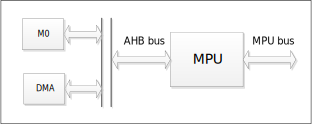
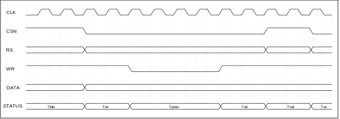

模块结构
^^^^^^^^^^^^^^^^^^

.. _MPU模块结构图:

   MPU模块结构框图

数据接口
^^^^^^^^^^^^

MPU模块包括RD、WR、RS、CS、DATA等控制接口。使用时将相关GPIO功能设置为MPU模块接口信号。

如表格 :numref:`MPU模块数据接口` 所示：

.. _MPU模块数据接口:
.. list-table:: MPU模块数据接口
   :widths: 14 12 46

   - 

      - **信号名称**
      - **信号方向**
      - **功能**
   - 

      - **RD**
      - O
      - MPU：I80接口下RD信号
   - 

      - **WR**
      - O
      - MPU：I80接口下WR信号，M68接口下E信号
   - 

      - **RS**
      - O
      - MPU：I80、M68接口下RS信号
   - 

      - **CS**
      - O
      - MPU：I80接口下CS信号，M68接口下CS、RW信号
   - 

      - **DATA**
      - I/O
      - MPU接口数据输出

接口时序
^^^^^^^^^^^^

MPU接口时序如 :numref:`MPU接口时序图` 所示：

.. _MPU接口时序图:

   
   MPU接口时序图

Tas周期从CS下降沿到WR下降沿，为地址建立时间；

Tpwlw周期从WR下降沿到上升沿，为WR操作脉冲宽度；

Tah周期从WR上升沿到CS上升沿，为地址保持时间；

Ttail周期从CS上升沿到CS下降沿，为与下次选通之间的时差。

操作说明
^^^^^^^^^^^^

-  配置CR寄存器，设置参数

-  CPU写IR寄存器，配置待访问寄存器地址

-  CPU写DR寄存器，写入数据，或者CPU读DR寄存器，接收数据

-  查询BUSY状态位为0，表示一个数据传输结束

如果使用DMA操作，需要先使能SR寄存器中的DMAEN位，然后根据写入或读出，将DR寄存器地址配置为DMA模块的目标地址或源地址，再启动DMA模块的操作
