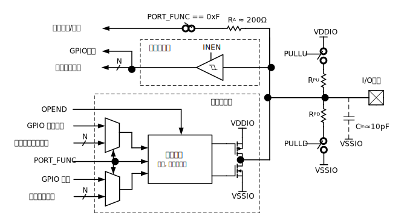

端口控制模块主要包括管脚输入使能，管脚功能配置，I/O上拉、下拉、推挽、开漏配置等。

模块结构
^^^^^^^^^^^^^^^^^^

PORTCON 模块单个 I/O 结构如 :numref:`PORTCON模块结构框图` 所示。

.. _PORTCON模块结构框图:

   PORTCON模块单个 I/O 结构示意图。此图中的 PORT_FUNC，OPEND, PULLU，PULLD 和 INEN 为某个I/O对应的 PORTx_FUNCy，OPEN_x，PULLU_x，PULLD_x， INEN_x （x = A， B， 或 C；y = 0 或 1）寄存器位域。   

功能选择配置
^^^^^^^^^^^^^

端口复用通过端口复用寄存器 PORTx_FUNCy 寄存器实现。当指定位配置为不同的值时，引脚功能实现切换。

每个端口可能具备以下功能：

-  通用 I/O（GPIO）输入/输出接口：引脚作为通用输入输出功能，输入或输出指定数字电平

-  外设输入/输出接口：将对应引脚切换至指定数字功能，如TIMER/UART/PWM等

-  模拟接口：将对应引脚切换至模拟功能，如模数转换器、时钟输入等

.. -  下载接口：使用仿真器连接下载程序及单步执行

.. 配置示意图如 :numref:`ref_portcon_pinconfig` 所示。

.. .. _ref_portcon_pinconfig:
.. .. figure:: ./images/PINconfig.svg
..    :name: portcon_pinconfig
..    :align: center
..    :scale: 100%

..    引脚配置示意图

引脚输入使能
^^^^^^^^^^^^^

本芯片引脚作为输入或需要输入的外设时，需要打开引脚对应输入使能寄存器（INEN_x），当引脚所在寄存器对应位设置为1时，施密特触发器输入使能打开，引脚可获取外部状态。

上拉/下拉/推挽/开漏配置
^^^^^^^^^^^^^^^^^^^^^^^^^^

本芯片每个引脚均可配置为以下模式：

-  上拉输入

-  下拉输入

-  推挽输出

-  开漏输出

当对应引脚作为除 GPIO 之外的功能引脚时，此配置同样生效。

作为输入功能使用时，可以开启内部上拉和下拉功能，通过配置 PULLU 及 PULLD 寄存器实现，将引脚所对应寄存器指定位配置为1，即可实现该功能。

.. 如 :numref:`ref_portcon_IOPULPULD` 所示：

.. .. _ref_portcon_IOPULPULD:
.. .. figure:: ./images/IOPULPULD.svg
..    :name: portcon_IOPULPULD
..    :align: center
..    :scale: 100%

..    IO输入上拉下拉

GPIO 或外设输出使能后，引脚作为输出功能使用，此时可配置引脚状态为推挽输出或开漏输出，通过配置 OPEND 寄存器实现。对应引脚电平，在 INEN_x 寄存器对应引脚位为 1 时，将反映到 GPIO 输入和外设输入寄存器。

作为推挽输出时，OPEND 寄存器对应位为 0，引脚具备拉/灌电流的能力。

.. 如 :numref:`ref_portcon_PULL` 所示：

.. .. _ref_portcon_PULL:
.. .. figure:: ./images/PULL.svg
..    :name: portcon_PULL
..    :align: center
..    :scale: 100%

..    推挽输出

作为开漏输出时，OPEND 寄存器对应位为 1，芯片只具备灌电流的能力，不具备拉电流能力。输出配置为 0 时，对应引脚将输出 0，配置为 1 时，输出高阻。若需要输出 1 时，需要将内部/外部引脚接上拉电阻，通过上拉实现高电平输出。

.. attention:: 开漏功能通过不激活P-MOS实现，不是真开漏，使用时必须遵循芯片VDDIO最大工作电压值

.. 如 :numref:`ref_portcon_OPENED` 所示：

.. .. _ref_portcon_OPENED:
.. .. figure:: ./images/OPENED.svg
..    :name: portcon_OPENED
..    :align: center
..    :scale: 100%

..    开漏输出

模拟配置
^^^^^^^^^^^^^
当引脚对应的 PORT_FUNC 为 0xF 时，功能配置为模拟功能，需要

-  配置 INEN 为 0，禁止施密特触发器输入
-  配置 PULLU 为 0， PULLD 为 0，不使能上下拉

输出在模拟模式下，硬件自动禁止输出。