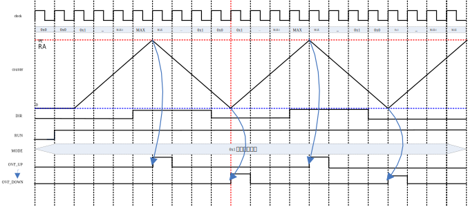
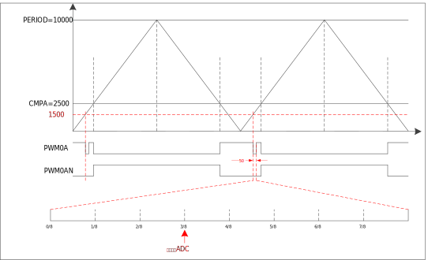

模块结构框图
^^^^^^^^^^^^^^^^^^^

PWM 模块结构如 :numref:`PWM模块结构框图` 所示。

.. _PWM模块结构框图:

   PWM 模块结构框图

时钟分频
^^^^^^^^^^^^

通过 CRx 寄存器 CLKSRC 和 CLKDIV位，可进行 PWM 工作时钟频率配置，支持工作时钟的分频范围为系统时钟的 1-1024 倍。

死区保护
^^^^^^^^^^^^

PWM 输出时 Dead Zone（死区）的作用是在电平翻转时插入一个时间间隔，避免关闭前一个设备和打开后一个设备时，因为开关速度的问题，出现同时开启状态而增加负荷的情况（在没有彻底关闭前打开了后一个设备），尤其是电流过大时容易造成短路等损坏设备。

此 PWM 模块每一路 PWM 的死区都独立配置，在独立模式和中心对称模式下均可配。效果为将上升沿推后指定周期。

当高电平周期设置为全 0 或者等于周期数，即占空比设置为 0 或 100 时，死区设置失效，此时输出电平为全低或全高。

死区示意图如 :numref:`PWM死区示意图` 所示：

.. _PWM死区示意图:

   
   PWM 死区示意图

计数器的启动与停止
^^^^^^^^^^^^^^^^^^^^^^

**边沿对齐模式**

向上计数时，如 :numref:`边沿对齐模式下向上计数时计数器启动与停止波形` 中如果IDLEAN为低，则需要插入死区，否则无死区。

START信号为上升沿触发，立即生效（系统时钟）。

STOP信号为高电平期间停止，低电平期间继续计数，立即生效（系统时钟）。

如 :numref:`边沿对齐模式下向上计数时计数器启动与停止波形` 所示：

.. _边沿对齐模式下向上计数时计数器启动与停止波形:

   边沿对齐模式下向上计数时计数器启动与停止波形

向下计数时，如 :numref:`边沿对齐模式下向下计数时计数器启动与停止波形` 所示，如果IDLEA为低，则需要插入死区，否则无死区。

.. _边沿对齐模式下向下计数时计数器启动与停止波形:
.. figure:: ./images/边沿对齐模式下向下计数时计数器启动与停止波形.svg
   :align: center
   :scale: 100%
   
   边沿对齐模式下向下计数时计数器启动与停止波形

**中心对齐模式**

波形如 :numref:`中心对齐模式下计数器启动与停止波形` 所示：

.. _中心对齐模式下计数器启动与停止波形:

   中心对齐模式下计数器启动与停止波形

**非对称中心对齐模式**

波形如 :numref:`非对称中心对齐模式下计数器启动与停止波形` 所示：

.. _非对称中心对齐模式下计数器启动与停止波形:

   非对称中心对齐模式下计数器启动与停止波形

计数器计数过程
^^^^^^^^^^^^^^^^^^

**边沿对齐模式**

波形如 :numref:`边沿对齐模式下计数器计数过程波形` 所示：

.. _边沿对齐模式下计数器计数过程波形:

   边沿对齐模式下计数器计数过程波形

**中心对称模式**

波形如 :numref:`中心对称模式下计数器计数过程波形` 所示：

.. _中心对称模式下计数器计数过程波形:

   中心对称模式下计数器计数过程波形

PWM 外部信号配置说明
^^^^^^^^^^^^^^^^^^^^^^^^

.. _PWM外部信号配置:

   PWM外部信号配置

*注：ext_event[0~4]分别接PWM_EVT0~4，ext_event[5~6]分别接TIMER0~1*

硬件刹车控制和软件刹车控制
^^^^^^^^^^^^^^^^^^^^^^^^^^^^^^

刹车功能可以控制x组y路PWM在BRK过程中输出电平的值，可以通过配置BRKCRx寄存器配置。

刹车功能同时可以控制在BRK过程中计数器是否停止计数。可通过配置BRKCRx寄存器STPCNT位配置在刹车过程中计数器是否继续计数或停止计数并清零。

刹车功能也可以控制在BRK信号撤销后PWM信号是否立即变为原始信号或刹车BRK的值直到当前计数周期溢出，PWM的信号才会跟随原始信号进行翻转。可通过配置BRKCRx寄存器OFFA/OFFB位分别配置A路信号和B路信号。

硬件刹车控制和软件刹车控制计数器计数波形如 :numref:`硬件刹车控制和软件刹车控制计数器计数情况` 所示：

.. _硬件刹车控制和软件刹车控制计数器计数情况:

   硬件刹车控制和软件刹车控制计数器计数情况

BRK过程并不会影响计数器的周期数、对比值等内容，仅仅控制计数器是否完成一次重新启动。

计数器重载
^^^^^^^^^^^^^^

RELOAD信号为上升沿触发，不立即生效，需等到计数器溢出后生效。

计数器的RELOAD
(重载)动作包含三个源头：由START动作引起、由主动CPU发起、由外部信号发起。

-  由START动作引起：CPU通过软件或硬件发起一次计数启动(START动作)时，完成自动重载。当计数器第一次启动或计数器从IDLE状态被重新启动时，都会在进入ACTIVE状态之后，自动完成重载动作。

-  由主动CPU发起：CPU通过写RELOAD寄存器

-  A：当CPU配置RELOAD_EN有效时，每当RPT_CNTER计到0且计数器溢出时，都会完成一次自动重载，即周期性的自动重载

-  B：当CPU配置RESTART_PWMX为1时，计数器会自动完成一次重载+重新启动的动作，即立即重载

-  外部信号发起：当发生EVMUXx寄存器中RELOAD所配置的ext_event[x]信号（ext_event上升沿），且RELOAD_EN有效时，计数器也会自动完成一次重载+重新启动动作，与CPU发起的立即重载类似

可通过配置IEx寄存器RELOADEN位配置计数器重载中断使能，IFx寄存器查看重载状态，此状态位为写1清零。

如 :numref:`计数器重载波形` 所示：

.. _计数器重载波形:

   计数器重载波形

*注：ext_event为计数器硬件触发信号，可以完成如下操作：*

*（1）计数器启动，上升沿启动*

*（2）计数器停止，高电平时停止，可以配置为停止到当前值，还是初始值（向上计数情况下，初始值是0，向下计数情况下，初始值是PERIOD）*

*（3）计数器暂停，高电平期间暂停，低电平期间正常计数*

*（4）寄存器REALOAD，上升沿触发，在当前周期溢出时完成RELOAD动作*

*（5）输出MASK，低电平期间PWM正常输出，高电平期间PWM被MASK到指定值*

PWM移相
^^^^^^^^^^^

在使用移相功能时，我们通常使用重启PWM来实现。

如在PWMx计数到周期六分之一时，对PWMx执行一次RESTERT，PWMx将从重新计数，及波形延迟了360/60度相位。

波形示意图如 :numref:`PWM移相示意图` 所示：

.. _PWM移相示意图:
.. figure:: ./images/PWM移相示意图.svg
   :align: center
   :scale: 100% 

   PWM移相示意图

PWM信号产生波形
^^^^^^^^^^^^^^^^^^^

以A路信号为例说明：

边沿对齐模式：

.. _边沿对齐模式下PWM信号产生波形:

   边沿对齐模式下PWM信号产生波形

中心对齐模式：

.. _中心对齐模式下PWM信号产生波形:

   中心对齐模式下PWM信号产生波形

非对称中心对齐模式：

.. _非对称中心对齐模式下PWM信号产生波形:

   非对称中心对齐模式下PWM信号产生波形

BRK情况下中心对齐模式：

.. _BRK中心对齐模式下PWM信号产生波形:

   BRK中心对齐模式下PWM信号产生波形

TRIGGER控制
^^^^^^^^^^^^^^^

PWM模块在计数过程中，可以根据配置输出三种trigger信号：

PWM计数器比较匹配触发：

PWM计数器在计数过程中，当计到TRIG_CNT中配置的参考值时，就会产生一个周期的trig信号。根据配置，可以将该trig信息映射到输出的trig[7:0]信号上，且输出宽度可以配置，以4个计数周期为单位进行设置，最小长度为0个（即不输出PWM_TRIG，只输出ADC_TRIG），最大长度为252个计数

当重复计数功能有效时，trig信号会在最后一次重复计数时产生。

ADC触发：

在PWM_TRIG输出宽度的正中间，会输出一个pclk的ADC_TRIG信号，用于触发ADC采样。

PWM计数器溢出触发：

当计数器溢出TRIG使能，且计数器发生向上溢出或向下溢出时，会产生一个pclk周期的TRIG信号，与自定义TRIG一致，可以根据配置将该trig信息映射到输出的trig[7:0]信号上。

TRIGGER控制波形如 :numref:`TRIGGER控制波形` 所示：

.. _TRIGGER控制波形:

   TRIGGER控制波形

重复计数功能
^^^^^^^^^^^^^^^^

重复计数器主要用于控制寄存器RELOAD的时机，在周期性自动重载情况下，只有当重复计数器计为0，且计数器溢出时，才会完成重载动作。

.. _重复计数功能波形图:

   重复计数功能波形图

触发SAR ADC采样
^^^^^^^^^^^^^^^^^^^

PWM在任意模式下可以触发ADC，每一路输出独立的ADC触发信号，且每个周期可以设置1个ADC触发点，每个PWM只输出一个触发信号，不区分A.B分别触发。

将SAR
ADC配置寄存器（CTRL）中TRIG方式设置为PWM触发。每路PWM对应1个ADTRG值，当PWM计数到指定值，可触发ADC进行采样。

另外，当使用PWM触发ADC时，需将CPU触发通道值与PWM通道触发通道值一致才能触发ADC，即ADC->CHSEL.SW和ADC->CHSEL.PWM的值必须一样，PWM触发ADC才有效。

具体配置方式如下：

-  配置PWMx路触发ADC控制寄存器，设置触发点是否有效以及PWM触发ADC时间点。

-  配置ADC的触发方式为PWM触发

-  使能PWM模块EN位，当计数值到达MATCH设置值时，触发ADC配置寄存器（CTRL）中选中的通道（CHx）进行采样，采样完成后，将产生EOC标志位，并产生ADC中断

示意图如 :numref:`PWM触发ADC采样示意图` 所示：

.. _PWM触发ADC采样示意图:

   PWM触发ADC采样示意图

电平翻转
^^^^^^^^^^^^

PWM模块支持电平翻转，可通过配置OUTCRx寄存器中INVA和INVB位，分别对应A通道和B通道。

如 :numref:`电平翻转示意图` 所示：

.. _电平翻转示意图:

   电平翻转示意图

挖坑及ADC触发功能
^^^^^^^^^^^^^^^^^^^^^

挖坑功能指的是外部信号在高/低电平期间输出被MASK到指定电平，也就是我们下面提到的MASK功能。

当MASK被使能之后，MASK_A/AN/B/BN有效期间，PWM输出被MASK到的值。MASK无效期间，PWM_A/AN/B/BN输出正常值。

此功能可以在PWM波形的任何位置挖坑，挖坑的方向可以是向上、也可以是向下，且A和AN的挖坑方向是可独立配置的。

MASK配置对所有的A/B/AN/BN路同时有效。

PWM输出可以配置为对MASK信号立即生效，还是在原始信号下一次翻转时生效。

可以在PWM_MASK_A/AN/B/BN有效期间，通过配置CMPTRGx寄存器中ATP位选择ADC_TRIG信号产生时机，可以在pwm_trig信号产生的同时，1/8，2/8······7/8等时间点生成一个系统时钟的adc_trig信号

-  在中心对齐模式下，通过配置CMPTRGx寄存器中DIR位，选择向上/向下计数过程中产生TRIG信号。

-  通过配置CMPTRGx寄存器中WIDTH位，设置
   Trigger计数器产生的匹配信号输出宽度，范围为0-252个计数时钟长度

.. _挖坑前波形:

   挖坑前波形

如图
1‑22所示，设置在PWM0计数器等于1500处在波形上挖两个电平为零的坑，并在坑的3/8宽度位置启动ADC。

PWM_CmpTrigger(PWM0, 1500, PWM_DIR_UP, 50, PWM_TRG_1,
3)，此语句为设置PWM0向上计数，计数值等于1500时发出一个触发信号，触发信号发送到
trigger1。

PWM_OutMask(PWM0, PWM_CH_A, PWM_EVT_1, 0, PWM_EVT_1,
0)，词语为设置PWM0A和PWM0AN在event1为高时分别输出0和0。

.. _挖坑后波形:

   挖坑后波形

