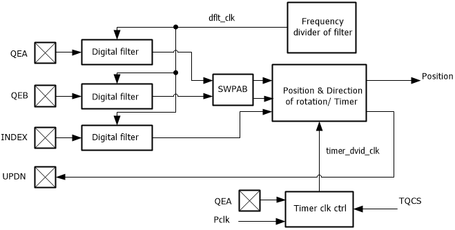
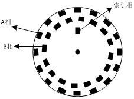
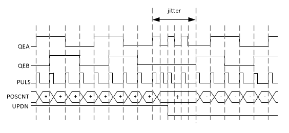
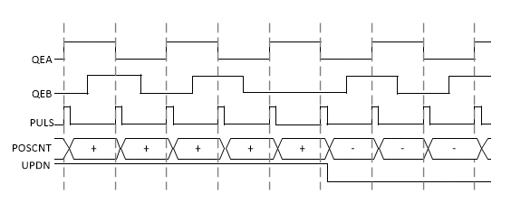
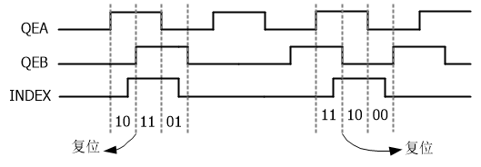
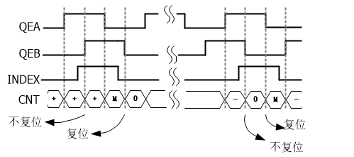

模块结构框图
^^^^^^^^^^^^^^

QEI 模块结构如 :numref:`QEI模块结构框图` 所示。

.. _QEI模块结构框图:

   QEI模块结构框图

功能说明
^^^^^^^^^^^^

典型的增量式编码器包括一个放置在电机转动轴上的带有开槽的轮子和一个用于检测开槽的发射/接收装置，通常有三个输出，分别为 A 相、B 相和索引相（INDEX），所提供的信息可被 QEI 接口解码，用来提供电机的运动信息，包括旋转距离和旋转方向，编码盘的示意图如 :numref:`QEI增量式正交编码盘示意图` 所示。

.. _QEI增量式正交编码盘示意图:

  增量式正交编码盘示意图

时序说明
^^^^^^^^^^^^

在正交编码器中 A 相（QEA）和B相（QEB）的位置关系是唯一的，如果A相超前B相，那么电机的旋转方向被认为是正向，反之则被认为是反向旋转，索引相作为基准来确定电机的绝对位置，电机每旋转一圈产生一个索引相脉冲信号，电机旋转时三个信号的相关时序如 :numref:`三相信号正向反向旋转时序关系` 所示。

.. _三相信号正向反向旋转时序关系:

   三相信号正向/反向旋转时序关系

正交解码器
^^^^^^^^^^^^^^

正交解码器的工作过程如 :numref:`正交编码器x4计数模式示意图` 和 :numref:`正交编码器x2计数模式示意图` 所示：

如 :numref:`正交编码器x4计数模式示意图` 中正交解码器工作在 x4 计数模式下，在 QEA、QEB 的上升沿和下降沿处都会计数。

计数的方向由正反转状态 UPDN 决定：

-  当 UPDN 为高电平时，表示电机正转，计数器在每个计数脉冲到来时累加计数结果；

-  当 UPDN 为低电平时，表示电机反转，计数器在每个计数脉冲到来时递减。

在电机换向旋转时若产生抖动（在 :numref:`正交编码器x4计数模式示意图` 中 jitter 为抖动部分），QEI 模块会根据检测到的计数脉冲情况判断是否产生抖动，在电机抖动的情况下，计数器不工作，直到电机恢复稳定状态为止。

.. _正交编码器x4计数模式示意图:

   
   正交编码器 x4 计数模式示意图

如 :numref:`正交编码器x2计数模式示意图` 所示：正交编码器工作在 x2 计数模式下，在该模式下，计数脉冲只在 QEA 的上升沿和下降沿处产生，QEB 只被用来判断旋转方向。

.. _正交编码器x2计数模式示意图:

   正交编码器 x2 计数模式示意图

计数器复位模式
^^^^^^^^^^^^^^^^^^

在 QEI 模块中支持两种复位模式：索引复位和计数匹配复位。

**索引复位**

索引复位的方式如 :numref:`QEI计数器索引复位模式` 所示，在 INDEX 信号到来时，QEI 计数器复位，旋转方向不变时计数器每次都将在索引信号的同一位置发生复位，正向旋转和反向旋转时的复位位置相对称，将 QEI 模块配置在索引复位模式下，QEI 模块将会自动检测 INDEX 信号和电机正转/反转时索引信号的复位位置。

.. _QEI计数器索引复位模式:

   QEI计数器索引复位模式

**匹配复位**

计数匹配复位发生在计数器的累加值与预置的目标计数值相等时发生。

在电机正向旋转时，计数器的累加值与最大计数值相等时发生复位，复位后计数器的值被置 0；

在电机反向旋转时，计数器的累加值在等于零时发生复位，复位后计数器的值被复位为预置的最大计数值，计数匹配复位方式如 :numref:`计数匹配复位模式` 所示。

.. _计数匹配复位模式:

   计数匹配复位模式

配置方式
^^^^^^^^^^^^

配置方式如下：

-  通过 PORTX_FUNC 寄存器将引脚切换为 QEI 对应数字功能，并使能数字输入

-  配置 QEI 工作模式（X2、X4）、最大计数值、复位源等设置

-  若需要使用中断，使能 QEI 相应中断

-  启动 QEI，开始计数

-  定时读取 QEI 位置计数器和最大值计数器，从而计算电机的转动方向和速度
  

中断配置与清除
^^^^^^^^^^^^^^^^^^

可通过配置 IE 寄存器设置 QEI 模块对应的中断，如需清除相应的中断标志，需在 IC 寄存器相应位中将中断状态写 1 清零（R/W1C）。
