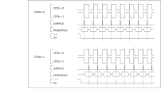

位速率的产生
^^^^^^^^^^^^

SPI模块包含一个可编程的位速率时钟分频器来生成串行输出时钟。串行位速率通过设置CTRL寄存器FAST、CLKDIV位对输入时钟进行分频来获得。分频值的范围为2~512分频值。计算公式如下F\ :sub:`sclk_out`
= F\ :sub:`PCLK1`/SCKDIV。

SPI_CLK最高支持30MHz时钟，时钟频率60MHz以下，支持2分频；60MHz以上，则需4分频。

帧宽度
^^^^^^

使能SPI模块前，可通过设置CTRL寄存器SIZE位选择数据帧长度，支持4～16位。设置该寄存器位时，需保证SPI处于关闭状态。

SPI模式
^^^^^^^

使能SPI模块前，可通过设置CTRL寄存器中FFS位域选择为SPI模式。此时，可通过CTRL寄存器中CPOL和CPHA配置SPI模块时钟空闲状态极性与数据采样时间点。

当CPOL=0，CPHA=0时，时钟空闲状态为低电平，起始采样点为时钟上升沿。

当CPOL=0，CPHA=1时，时钟空闲状态为低电平，起始采样点为时钟下降沿。

当CPOL=1，CPHA=0时，时钟空闲状态为高电平，起始采样点为时钟下降沿。

当CPOL=1，CPHA=1时，时钟空闲状态为高电平，起始采样点为时钟上升沿。

输出波形如 :numref:`ref_spi_waveform` 所示：

.. _ref_spi_waveform:

   SPI模式波形图

所有模式下，片选线均为发送一个数据后自动拉高，第二个数据再次拉低，因此当需要使用连续片选时，需使用GPIO模拟片选线。

SSI模式
^^^^^^^

可通过设置CTRL寄存器中FFS位选择输出模式，当选择SSI模式时，单次输出波形如
   :numref:`ref_ssi_one_out_waveform` 所示：

.. _ref_ssi_one_out_waveform:

   SSI模式单次输出波

连续输出波形如 :numref:`ref_ssi_continuous_out` 所示：

.. _ref_ssi_continuous_out:

   SSI模式连续输出波形

主设备操作
^^^^^^^^^^

当SPI模块作为主模块工作时，操作流程如下：

-  通过CTRL寄存器CLKDIV位定义串行时钟波特率

-  设置CTRL寄存器SIZE位来选择数据位数

-  选择CTRL寄存器CPOL和CPHA位，定义数据传输和串行时钟间的相位关系。主、从设备的CPOL和CPHA位必须一致

-  配置CTRL寄存器FFS位定义数据帧格式，主、从设备的数据帧格式必须一致。

-  设置CTRL寄存器MSTR位为主模式

-  使能CTRL寄存器EN位

在主设备配置中，MOSI引脚是数据输出，而MISO引脚是数据输入。

注：当选择硬件提供的CS引脚作为从设备片选使能时，每传输一个字节的数据，CS引脚均会变高。因此，当从设备需要连续拉低的片选信号时，需要使用GPIO模拟CS信号。

从设备操作
^^^^^^^^^^

在从模式下，SCK引脚用于接收从主设备来的串行时钟。对CTRL寄存器中CLKDIV的设置不影响数据传输速率。

操作流程：

-  设置CTRL寄存器SIZE位来定义数据位数选择。

-  选择CTRL寄存器CPOL和CPHA位，与主设备一致。

-  配置CTRL寄存器FFS位定义数据帧格式。

-  设置CTRL寄存器MSTR位为从模式

在从设备配置中，MOSI引脚是数据输入，MISO引脚是数据输出。

FIFO操作
^^^^^^^^

发送FIFO

   通用发送FIFO是一个32位宽、8单元深、先进先出的存储缓冲区。通过写DATA寄存器来将数据写入发送FIFO，数据在由发送逻辑读出之前一直保存在发送FIFO中。并行数据在进行串行转换并通过MOSI管脚分别发送到相关的从机之前先写入发送FIFO。

接收FIFO

   通用接收FIFO是一个32位宽、8单元深、先进先出的存储缓冲区。从串行接口接收到的数据在读出之前一直保存在缓冲区中，通过读DATA寄存器来访问读FIFO。从MISO管脚接收到的串行数据在分别并行加载到相关的主机接收FIFO之前先进行记录。

可通过中断使能寄存器IE、中断状态寄存器IF、状态寄存器STAT对FIFO状态及中断进行查询与控制。

中断配置与清除
^^^^^^^^^^^^^^

可通过配置中断使能寄存器IE相应位使能中断。当中断触发后，中断标志寄存器IF对应位置1。如需清除此标志，需在对应标志位中写1清零（R/W1C），否则中断在开启状态下会一直进入。
