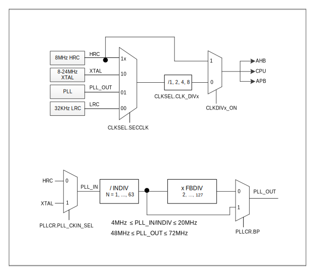
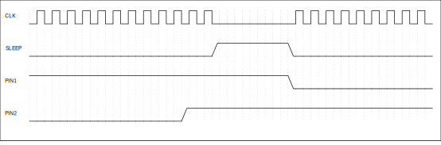

时钟控制
^^^^^^^^

SWM221有4个时钟源可供使用：

-  内部高频振荡器（HRC）：内部高频振荡器为片内时钟源，无需连接任何外部器件。频率为 8MHz，通过 RCCR 寄存器进行切换，可提供较精确的固定频率时钟

-  内部低频振荡器（LRC）：内部低频振荡器为片内时钟源，无需连接任何外部器件。频率为 32KHz

-  外部振荡器（XTAL）：外部振荡器可接 8~24MHz 频率

-  锁相环（PLL）：时钟源可选 HRC 或 XTAL, 48MHz~72MHz

系统时钟结构如 :numref:`syscon_clk_tree` 所示。

.. _syscon_clk_tree:

   时钟结构框图

对于主时钟选择，通过 CLKSEL 寄存器 SYSCLK 位，选择内部高频时钟或其他时钟。

CLKSEL 寄存器 SYSCLK 位，选择内部高频时钟（HRC），时钟源为 8MHz，此时 CLKSEL 寄存器 SRCDIV 位无效。

CLKSEL 寄存器 SYSCLK 位，选择 SRC_DIV_CLK，通过 SRCCLK 位可选择时钟源为片内 HRC 振荡器、片外高频晶体振荡器、片内 LRC 振荡器、片内 PLL，此时 CLKSEL 寄存器 CLKDIV 位有效。

当 CLKSEL 寄存器 SRCCLK 选择片外时钟。选择片外时钟前，需将相应引脚输入使能通过 INEN_x 寄存器打开，并通过寄存器 PORTx_FUNC 将相应引脚换至外接晶振功能，且将 XTALCR 寄存器中外接晶振使能位使能。完成上述操作后，需根据外部晶振起振时间，使用软件产生一定时间，确保晶振稳定震荡，最后将 CLKSEL 寄存器中相应位设置为片外震荡器。

.. attention::
  执行时钟切换时，需要保证目标时钟使能及通路打开，系统时钟选择不同时钟切换时，系统时钟需要先切换回HRC，然后将CLKDIV_ON置为1后再进行切换。

内部 HRC 可通过 RCCR 寄存器 ON 位进行关闭操作，关闭前需确认时钟已切换，并未使用即将执行关闭操作的时钟。

内部 LRC 可通过 RCCR 寄存器 32KON位进行关闭操作，关闭前需确认时钟已切换，并未使用即将执行关闭操作的时钟。

外设时钟控制功能可控制外设时钟打开及关闭，如：

-  GPIO
-  SARADC
-  DIV
-  I2C
-  PWM
-  TIMER
-  WDT
-  UART

.. attention:: 
   上电后，以上模块均处于时钟关闭状态，需要通过设置CLKEN寄存器进行时钟使能，否则访问对应模块寄存器操作无效。

休眠与唤醒设置
^^^^^^^^^^^^^^

SWM221系列提供浅睡眠（SLEEP）模式，通过SLEEP寄存器进行使能操作。

**浅睡眠模式**

浅睡眠模式下，芯片进入保持状态，所有时钟关闭，在功耗较低的前提下保持数据。可以通过配置任意I/O引脚进行唤醒操作。IO唤醒操作同样为下降沿唤醒。唤醒后，程序从睡眠使能语句继续执行。

在sleep之前，需要将时钟切换为内部高频。

.. attention:: 
   浅睡眠模式使能前需保证 LRC（32KHZ）时钟为使能状态，且将所有不需要唤醒操作的 IO 输入使能关闭（PORTCON 模块中 INEN_x 寄存器）。

.. important:: 
   FLASH 深睡眠模式使能独立控制，默认为开启状态，进入睡眠模式和唤醒不需要单独操作，在核唤醒 FLASH 在 20us 后自动唤醒，在这 20us 内不能对FLASH操作，建议在SRAM中运行睡眠以及唤醒和等待的操作。

**端口唤醒**

浅睡眠模式下，可指定任意 IO 进行唤醒操作。

示意图如 :numref:`syscon_pin_wakeup`  所示。

具体流程如下：

-  确认LRC（32KHZ时钟）为使能状态

-  将需要执行唤醒操作的引脚对应PxWKEN寄存器及INEN_x寄存器指定位配置为1，使能相应端口对应位输入使能及唤醒功能

-  系统时钟切换为HRC,关闭PLL和XTAL，GPIO无外围器件接入时，设置成输出高，有外围器件根据不同情况设置GPIO状态以达到功耗最低

-  SLEEP寄存器BIT[0] = 1后，芯片进入浅睡眠模式

-  唤醒端口可配置为GPIO端口，以及UART模块RX端口或I2C模块DAT端口，当配置端口对应位产生下降沿时，芯片被唤醒，继续执行程序。使用通讯接口进行唤醒时，需保证通讯采样速率低于32KHZ，避免出现数据丢失现象

-  唤醒后，端口对应PxWKSR寄存器对应位被置1，可通过对该位写1进行清除（该位对进入休眠无影响）

-  如开启FLASH的深度睡眠模式，等待20us后再对FLASH进行操作

.. attention:: 
   所有配置为唤醒功能的引脚，执行唤醒过程时只能有一个产生下降沿，对应引脚必须保证为高电平。为保证功耗最低，需确认所有输入使能引脚无悬空输入状态

   端口唤醒示意图

LVR
^^^

芯片提供了低电压复位(Low voltage reset )功能,通过LVRCR寄存器配置。

通过配置寄存器LVRCR，可选择相应复位电压产生复位，使整个芯片处于复位状态。

配置方法

1. 写寄存器LVRCR.EN使能LVR

2. 写寄存器LVRCR.LVL配置复位电压

3. 写LVRCR.WEN 配置LVR模块写使能后步骤1和2生效

配置完成后，当电压降低到：LVRCR.LVL配置电压后，芯片处于复位状态

PVD
^^^

可编程电压检测器PVD模块通过PVDCR寄存器配置芯片掉电进入中断的阈值。

配置方法

1. 写寄存器PVDCR.EN使能PVD

2. 写寄存器PVDCR.LVL配置中断电压

3. 写寄存器PVDCR.IE使能中断

PVDSR.IF位为中断状态位，当芯片供电电压小于等于配置电压时，该位将被置1(电平处罚)。此时若PVDCR.IE位为非屏蔽状态（PVDCR.IE=1）），则NVIC控制器将收到PVD中断

该中断可通过PVDSR.IF位写1清除。

用户ID
^^^^^^

芯片可以提供128位唯一ID。

IO_FILTER
^^^^^^^^^

芯片提供一组GPIO滤波器和一组CMP滤波器

-  IO_FILTER0为GPIO输入滤波，对应GPIO为B14, B4, B5, B6

-  IO_FILTER1为CMP输出滤波，对应CMP0_OUT, CMP1_OUT

配置方法：

FILTER0.IOSEL 为 xxx1
则B14具有滤波功能，xx1x时则B4有滤波功能，x1xx时则B5有滤波功能，1xxx时则B6有滤波功能,为1111时，B14
B4 B5 B6都有滤波功能

FILTER1.IOSEL
为xx01时CMP0输出滤波开启，为xx10时CMP1输出滤波功能开启，xx11时CMP0和CMP1都有滤波功能