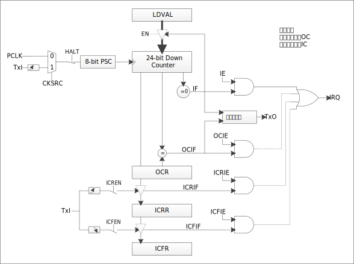
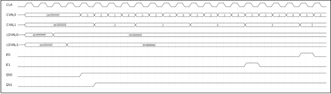
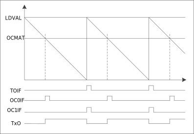
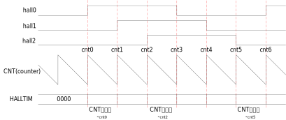
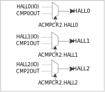

模块结构框图
^^^^^^^^^^^^^^

.. _TIMER模块结构框图:

   TIMER模块结构框图

定时器
^^^^^^^^^^

使用TIMERx作为定时器时，为递减计数。流程如下：

-  将控制寄存器（CRx）中MODEx位配置为定时器，CLKSRCx位配置计数源选择，配置为使用系统时钟作为计数源。

-  通过装载值寄存器（LOADx）设置计数起始值。

-  使能寄存器（EN）对应位使能为1。

-  对应TIMERx开始递减计数，计数到0时，产生中断，同时重新装载计数值，进行下一周期计数。

在计数过程中，可通过对当前值寄存器（VALUEx）进行读取，获取当前计数值。

定时器计数过程中改变装载值寄存器（LOADx）值，将在下个计数周期（计数到0重新装载）生效，不会改变本周期计数值。

定时器计数过程中，可以通过HALT寄存器控制位置1暂停指定通道计数，置0后继续计数。

如 :numref:`TIMER定时器工作示意图` 所示。

.. _TIMER定时器工作示意图:

   定时器工作示意图

计数器
^^^^^^^^^^

使用TIMERx作为计数器时，为递减计数。流程如下：

-  将控制寄存器（CRx）中MODEx位配置为计数器，CLKSRCx位计数源选择配置为外部的触发信号的上升沿。此时，对应TIMER将以配置为CNT引脚外部输入的上升沿作为计数目标。

-  针对外部信号输入引脚进行如下操作：

   -  配置PORTCON模块中INEN寄存器使能引脚输入功能。

   -  通过PORTX_FUNC寄存器将引脚切换为指定数字功能。

-  通过装载值寄存器（LOADx）设置计数目标值。

-  使能寄存器（EN）对应位使能为1，对应TIMERx开始递减计数，计数到0时，产生中断，同时重新装载计数值，进行下一周期计数。

在计数过程中，可通过对当前值寄存器（VALUEx）进行读取，获取当前计数值。

定时器计数过程中改变装载值寄存器（LOADx）值，将在下个计数周期（计数到0重新装载）生效，不会改变本周期计数值。

计数器使用过程中，可以通过HALT寄存器控制位置1暂停指定通道计数，置0后继续计数。

示意图如 :numref:`计数器工作示意图` 所示。

.. _计数器工作示意图:

   计数器工作示意图

级联
^^^^^^^^

当TIMER无法满足计数宽度或时间长度时，可以通过级联方式，使计数周期为TIMER位宽相乘的关系。最高支持两级级联。

使用方式如下：

-  TIMERn根据需要设置为定时器或计数器模式

-  TIMERn+1设置为级联模式（CLKSRCx位配置为使用上一路计数器的进位标志）

-  LOADn = 目标计数值A

-  LOADn+1 = 目标计数值B，总计数周期为A*B

-  使能TIMERn+1中断

-  使能TIMERn+1

-  使能TIMERn

-  TIMERn+1中断产生，在中断程序中使能TIMERn中断

-  TIMERn中断产生，计数周期完成

示意图如 :numref:`级联模式工作示意图` 所示：

.. _级联模式工作示意图:

   级联模式工作示意图

脉冲发送
^^^^^^^^^^^^

所有TIMER模块均支持脉冲发送功能，可发送指定脉宽的方波。该计数器为向下计数。使用方式如下：

-  针对外部信号输入引脚进行如下操作

   -  配置PORTCON模块中使能引脚输出功能

   -  通过PORTX_FUNC寄存器将引脚切换为TIMER对应数字功能

-  TIMER初始化

   -  指定要被设置的定时器

   -  设置TIMER的工作模式为OC(输出比较)模式

   -  设置定时周期

-  输出比较功能初始化

   -  指定要被设置的定时器

   -  设置当计数器的值递减到MATCH时引脚输出电平翻转

   -  设置初始输出电平

-  启动定时器

-  每次周期结束时，会更新翻转电平配置

示意图如 :numref:`TIMER脉冲发送示意图` 所示：

.. _TIMER脉冲发送示意图:

   脉冲发送示意图

脉冲捕捉
^^^^^^^^^^^^

所有TIMER模块均支持用于捕捉外部脉宽，可记录外部单个脉冲宽度。

使用方式如下：

-  针对外部信号输入引脚进行如下操作

   -  配置PORTCON模块中INEN寄存器使能引脚输入功能

   -  通过PORTX_FUNC寄存器将引脚切换为TIMER对应数字功能

-  设置中断使能寄存器（IEx），使能中断

-  使能寄存器（EN）对应位使能，启动捕捉功能

-  当指定引脚出现变化沿时，开始记录宽度，再次出现沿时，将对应种类的脉宽长度记录于ICLOWx或ICHIGHx寄存器，并产生中断。

-  进入中断，读取脉冲长度寄存器，获取指定种类的脉冲宽度

-  如果不操作EN位，则持续记录电平宽度，直至EN位关闭。

捕捉高电平示意图如 :numref:`单次高电平捕捉示意图` 所示。

.. _单次高电平捕捉示意图:

   单次高电平捕捉示意图

低电平示意图如 :numref:`单次低电平捕捉示意图` 所示。

.. _单次低电平捕捉示意图:
.. figure:: ./images/单次低电平捕捉示意图.svg
   :align: center
   :scale: 100%
   
   单次低电平捕捉示意图

霍尔接口
^^^^^^^^^^^^

TIMER0模块提供了HALL接口功能，能够自动记录脉冲变化间隔，并产生中断。

使用方式如下：

-  HALL功能为指定引脚，且不同封装可能有所差异，具体引脚详见管脚排布：

   -  配置PORTCON模块中INEN寄存器使能引脚输入功能

   -  通过PORTX_FUNC寄存器将引脚切换为HALL功能

-  配置HALLSR寄存器，设置对应HALL输入信号的原状态

-  配置TIMER0装载值寄存器（LOADx）

-  使能HALL模式控制寄存器中输入HALL信号触发使能位（HALLEN）

-  清除输入HALL信号触发中断的状态（HALLIF）

-  使能HALL中断（HALLIE）

-  TIMER0使能（EN）

-  当外部HALLX引脚产生指定电平变化时，将（计数器加载值-计数器当前值）的结果保存到寄存器HALLDR中，计数器复位到加载值重新计数，并产生TIMER中断。同时HALLIF寄存器IFx将产生对应标示位，标识对应引脚产生电平变化。

记录示意图如 :numref:`HALL记录值` 所示。

.. _HALL记录值:

   HALL记录值

HALL0、HALL1、HALL2是HALL功能的三个输入引脚，任意一个HALL引脚上出现跳变沿时，将（计数器加载值-计数器当前值）的结果保存到寄存器HALLDR中，并且计数器复位到加载值重新计数。

HALL0~2信号输入同时支持连接至CMP0~2，可通过ACMPCR2寄存器HALLx位配置,可选择为CMPxOUT引脚或者HALL
IO引脚。

.. _HALL对应关系图:

   HALL对应关系图

中断配置与清除
^^^^^^^^^^^^^^^^^^

每路TIMER均具备独立中断，通过中断使能寄存器IE进行各TIMER中断使能。通过中断状态寄存器IF进行中断查询及清除。

TIMER中断

可通过配置中断使能寄存器IEx相应位使能中断。当检测到中断触发条件时，中断标志寄存器IFx相应位中置1。如需清除此标志，需在相应标志位中写1清零（R/W1C），否则中断在开启状态下会一直进入。

HALL中断

可通过配置HALL模式控制寄存器对应位设置输入HALLx信号触发中断的条件：上升沿、下降沿、上升沿和下降沿。可通过配置HALL中断使能寄存器HALLIE相应位使能中断。当检测到中断触发条件时，HALL中断标志寄存器HALLIF相应位中置1。如需清除此标志，需在相应标志位中写1清零（R/W1C），否则中断在开启状态下会一直进入。
