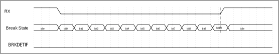
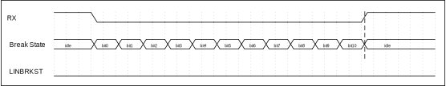
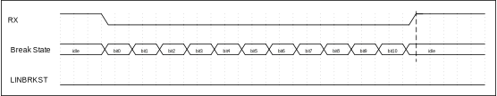
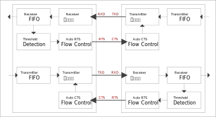
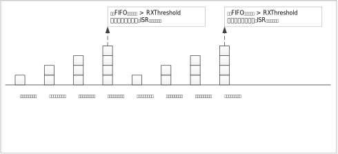
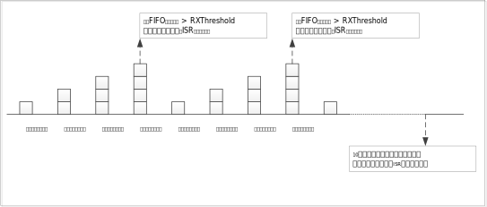
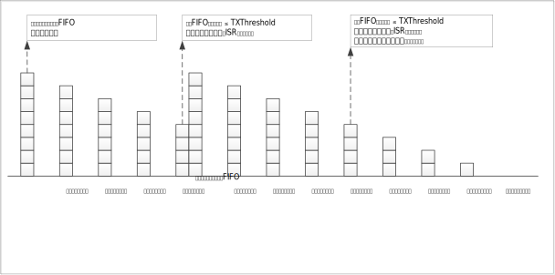

数据格式及波特率配置
^^^^^^^^^^^^^^^^^^^^

**数据位**

可以通过向CTRL寄存器的DATA9B位写1，选择支持9位数据模式。该位默认为0，即8位数据模式

**奇偶校验位**

CTRL寄存器PAREN位使能奇偶校验，PARMD
位选择奇偶校验模式，分别有奇校验、偶校验、常1、常0等四种校验格式，根据需求可以灵活选择配置具体看下表：

.. list-table::
   :widths: 18 18 18 17
   :header-rows: 1

   *  - 校验类型
      - CTRL[21]
      - CTRL[20]
      - CTRL[19]
   *  - 无校验
      - x
      - x
      - 0
   *  - 奇校验
      - 0
      - 0
      - 1
   *  - 偶校验
      - 0
      - 1
      - 1
   *  - 校验位常为1
      - 1
      - 0
      - 1
   *  - 校验位常为0
      - 1
      - 1
      - 1

**停止位**

停止位位数默认为1位，可通过向CTRL寄存器STOP2B位选择停止位位数为2位。
 
字符格式如 :numref:`ref_uart_character` 所示：

.. _ref_uart_character:

.. figure:: ./images/uart_character.svg
   :name: uart_character
   :align: center
   :scale: 150%

   UART字符格式

使能波特率配置后，对BAUD寄存器BAUD位写入特定值，配置波特率。

配置方式如下：

目标波特率 = 系统主时钟 / (BAUD.BAUD \*16 +BAUD.FRAC + 1)

波特率配置完成后，需将CTRL寄存器EN位使能，使能UART模块，使波特率配置生效。

自动波特率功能
^^^^^^^^^^^^^^

UART自动波特率功能可以自动测量UART_RX脚输入数据的波特率。当自动波特率测量完成后，测量的结果保存在BAUD寄存器的BAUD位。

自动波特率的检测时间，从UART_RX数据的起始位到第一个上升沿的时间，通过配置BAUD寄存器ABRBIT位设定检测的时间长度，即2
:sup:`ABRDBITS`\ 位。配置BAUD寄存器ABREN位，使能自动波特率检测功能。

以BAUD.ABRBIT=0，即设定检测的时间长度1位，通过测量起始位脉宽计算波特率为例：初始阶段，RXD保持为1，一旦检测到下降沿，即为接收到起始位，自动波特率计数器开始计数，当检测到第一个上升沿时，自动波特率计数器停止计数。

自动波特率计数值除以检测时间长度的结果保存在BAUD位，ABREN位清零。

当自动波特率计数器溢出，BAUD寄存器的ABRERR置1，调节失败，写1清零。

配置流程：

-  选择检测时间的长度，配置BAUD寄存器ABRBIT位

-  配置BAUD寄存器ABREN位，使能自动波特率检测功能

-  等待接收调节的数据，查看BAUD寄存器ABREN位是否清零，清零表示波特率检测完成

-  检测完成后查看BAUD寄存器ABRERR位，查看自动调节波特率时计数器是否溢出

-  如果数据未溢出，则表示成功

   自动波特率示意图

数据发送及接收
^^^^^^^^^^^^^^

将控制及状态寄存器（CTRL）EN位置1后，对应UART模块使能

对于发送操作：

-  向DATA寄存器写入数据，数据发送至UART_TX线

-  通过读取CTRL寄存器TXIDLE位状态，获取当前发送状态

-  可通过读取BAUD寄存器TXD位，获取当前TX线实时状态

对于接收操作：

-  通过判断DATA寄存器中VALID位，判断是否接收到有效数据

-  当接收到有效数据后，读取DATA寄存器，可获得UART_RX线接收的数据

-  可通过读取BAUD寄存器RXD位，获取当前RX线实时状态

-  可设置接收超时中断。使能后，当接收相邻两个数据间隔时长超过设置时长时，将触发中断

电平反向
^^^^^^^^^^^^^^

通过设置CFG寄存器的TXINV位及RXINV位，分别对TX和RX线设置取反，设置后电平立刻生效。

大小端控制
^^^^^^^^^^

通过CFG寄存器的MSBF位进行配置，设置数据传输是从高位(MSB)开始传输还是从低位(LSB)

LIN Fram
^^^^^^^^^^^^^^

UART 支持 LIN 功能。在主机模式下，支持 LIN_BREAK 产生，在从机模式下，支持 LIN_BREAK 检测。报文是以报文帧的格式传输和发送。报文帧由主机节点发送的报文头和从机发送的应答组成。报文帧的报头包括 break 域，同步域和帧识别码（帧ID）。帧 ID 仅作为定义帧的用途，从机负责响应相关的帧 ID，响应由数据域和校验域组成。

   LIN Fram示意图

当使用LIN Fram时，可通过LINCR寄存器进行相关设置。

发送操作：

与正常的UART发送相比，选用LIN Fram发送时，除了基本操作步骤外，还需：

-  通过配置CFG寄存器BRKTXLEN位配置发送BRK的长度

-  置位LINCR寄存器中GENBRK位，TX线上会发送设定的BRK的长度位时间的低电平

-  设定的BRK的长度位低电平发送完成时LINCR寄存器GENBRK自动清零，LINCR寄存器GENBRKIF置位

-  LINCR寄存器GENBRK清零后，软件可以写DATA寄存器发送数据

注意：发送BREAK信号时，向DATA寄存器写入数据，数据同样会执行发送操作，但数据电平不会体现到TX线上，除非发送数据期间清除CTRL寄存器GENBRK位。

接收操作：

与正常的UART接收相比，选用LIN Fram接收时，除了基本操作步骤外，还需：

-  通过配置CFG寄存器BRKRXLEN位配置接收BRK的判定长度

-  通过LINCR寄存器将BRKDETIE位置1，使能检测到Break信号中断

-  当RX线上出现低电平宽度超过设定判断长度时，LINCR寄存器BRKDETIF置位，执行UART中断处理函数

-  在UART中断处理函数中检测LINCR寄存器BRKDETIF是否为1，，如果为1表示检测到了break，向BRKDETIF写1清除中断标志

当Break信号不够长时，丢弃Break，BRKDETIF不置1，如 :numref:`ref_uart_break_not_long_enough` 所示：

.. _ref_uart_break_not_long_enough:

   Break信号不够长示意图

当Break信号恰好够长时，等接收线上收到高电平后，检测到Break，BRKDETIF置1，如 :numref:`ref_uart_break_long_enough` 所示：

.. _ref_uart_break_long_enough:

   Break信号恰好够长示意图

当Break信号足够长时，等接收线上收到高电平后，检测到Break，BRKDETIF置1，如 :numref:`ref_uart_break_over_long_enough` 所示：

.. _ref_uart_break_over_long_enough:

   信号足够长示意图

**硬件流控**

硬件流控（RTS/CTS）制主要功能为防止串口传输时出现丢失数据的现象，使用流控制功能时需将通信两端的RTS和CTS对应相连，通过RTS和CTS可以控制两个串口设备间的串行数据流。

**RTS流控制**

RTS为输出信号，通过自动流控控制寄存器使能该信号并设置有效极性（高电平/低电平）以及触发阈值，当RTS为有效电平时表示可以接收数据，当接收数据达到所设置的阈值时，RTS无效。

**CTS流控制**

CTS为输入信号，通过自动流控控制寄存器使能该信号并设置有效极性（高电平/低电平），当RTS为有效电平时表示可以发送数据。

   硬件流控

接收中断与超时中断
^^^^^^^^^^^^^^^^^^

以如下配置为例：

**方式一：FIFO清空后，不产生超时中断**

-  配置FIFO寄存器RXLVL位为3，即RXThreshold=3，接收FIFO取值3

-  配置CTRL寄存器RXIE位为1，即RXThresholdIEn=1，配置接收FIFO中的个数>
   RXThreshold时触发中断

-  配置TOCR寄存器TIME位为10，即TimeoutTime = 10，超时时长 =
   TimeoutTime/(Baudrate/10) 秒

-  配置UARTx.TOCR寄存器MODE位为0，FIFO清空后，不产生超时中断

-  配置CTRL寄存器TOIE位为1，即TimeoutIEn =
   1，超时中断，超过TimeoutTime/(Baudrate/10)
   秒没有在RX线上接收到数据且接收FIFO中数据个数不为零时可触发中断

对方发送8个数据

   对方发送8个数据接收FIFO示意图

每接收到一个数据，RX FIFO中数据个数加一，当RX
FIFO中数据个数大于RXThreshold时，触发接收中断。

   对方发送9个数据接收FIFO示意图

只有当接收FIFO中有数据，且在指定时间内未接收到新的数据时，才会触发超时中断。

若应用中希望通过数据间时间间隔作为帧间隔依据，即不管对方发送过来多少个数据，最后都能产生超时中断，可以通过在接收ISR中从RX
FIFO中读取数据时总是少读一个（即让一个数据留在RX FIFO中）来实现。

**方式二：无论FIFO是否清空，间隔指定时间后均产生超时中断**

-  配置FIFO寄存器RXLVL位为3，即RXThreshold=3，接收FIFO取值3

-  配置CTRL寄存器RXIE位为1，即RXThresholdIEn=1，配置接收FIFO中的个数
   RXThreshold时触发中断

-  配置TOCR寄存器TIME位为10，即TimeoutTime = 10，超时时长 =
   TimeoutTime/(Baudrate/10) 秒

-  配置UARTx.TOCR寄存器MODE位为1，无论FIFO是否清空，间隔指定时间后均产生超时中断

-  配置CTRL寄存器TOIE位为1，即TimeoutIEn = 1，超时中断，超过
   TimeoutTime/(Baudrate/10) 秒没有在RX线上接收到数据时可触发中断

无论接收FIFO中是否有数据，只要在指定时间内未接收到新的数据时，就会触发超时中断。

发送中断
^^^^^^^^

以如下配置为例：

-  配置FIFO寄存器TXLVL位为3，即TXThreshold = 4，发送FIFO取值4

-  配置CTRL寄存器TXIE位为1，即TXThresholdIEn = 1，配置发送FIFO中的个数
   TXThreshold时触发中断

   发送FIFO示意图

每发送出一个数据，TX_FIFO中数据个数减1，当TX_FIFO中数据个数小于等于TXThreshold时，触发发送中断。

如果初始化时TX_FIFO中数据个数为零，则开启发送中断后会立即触发发送中断。建议在发送FIFO填入数据后再开启发送中断。

中断清除
^^^^^^^^

此模块中中断状态位详见寄存器中各个中断标志位属性，当其中断标志位属性为R/W1C时，如需清除此标志，需在对应标志位中写1清零（R/W1C），否则中断在开启状态下会一直进入；当其中断标志位属性为AC时，表示此中断状态位会自动清零；当其中断标志位属性为RO时，表示此标志位会随着水位的变化而改变，标志位只与其当前状态有关，不需要清除。具体详见寄存器描述。

