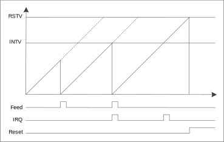

看门狗定时器（WDT）主要用于控制程序流程正确，在程序流程时间未按既定流程执行指定程序的情况下复位芯片。

WDT 模块功能分为普通模式和窗口模式。在普通模式下，任何时候都可以喂狗执行 WDT 复位操作；在窗口模式下，只能在 WDT 中断之后、WDT 复位之前喂狗，如果喂早了（在 WDT 中断之前）那么立即复位。

模块结构框图
^^^^^^^^^^^^^^^^^^

WDT 模块结构如 :numref:`WDT模块结构框图` 所示。

.. _WDT模块结构框图:

   WDT 模块结构框图
   
普通模式
^^^^^^^^^^^

工作示意图如 :numref:`WDT普通工作模式`  所示：

.. _WDT普通工作模式:

   普通模式工作示意图

配置方式如下：

-  配置复位值寄存器RSTVAL，设置复位值，WDT为递增计数

-  配置控制寄存器CR中RSTEN位，设置以系统时钟为单位递增时产生中断或产生复位

-  将控制寄存器CR中EN位置1，使能WDT模块

-  程序执行过程中通过向FEED寄存器写入0x55喂狗，重启计数，两次喂狗至少间隔5个及以上WDT时钟周期

-  若当VALUE寄存器加至INTVAL或RETVAL，依然未执行喂狗操作，则根据CR寄存器设置，产生中断或复位信号

.. attention:: 在使用看门狗定时器（WDT）时需要注意：WDT启用与FEED WDT之间至少间隔5个及以上WDT时钟周期

控制寄存器CR中RSTEN位配置为复位使能时，使能后波形如 :numref:`WDT配置为RESET模式波形` 所示:

.. _WDT配置为RESET模式波形:

   WDT 配置为 RESET 模式波形图

控制寄存器CR中RSTEN位配置为复位失能时，使能后波形如 :numref:`WDT配置为中断模式波形` 所示，中断产生后，通过IF寄存器进行清除。

.. _WDT配置为中断模式波形:

   WDT 配置为中断模式波形图

窗口模式
^^^^^^^^^^^

在窗口模式下，只能在WDT中断之后、WDT复位之前喂狗，如果在WDT中断之前喂狗，则立即执行WDT复位操作。

在窗口模式下看门狗发生中断及复位与计数值之间的关系示意图如 :numref:`窗口模式WDT发生中断及复位与计数值之间的关系` 所示：

.. _窗口模式WDT发生中断及复位与计数值之间的关系:

   窗口模式 WDT 发生中断及复位与计数值之间的关系示意图

配置方式如下：

-  配置复位值寄存器RSTVAL，设置复位值，WDT为递增计数

-  配置控制寄存器CR中WINEN位，使能窗口功能

-  配置控制寄存器CR中RSTEN位，设置以系统时钟为单位递增时产生中断或产生复位

-  将控制寄存器CR中EN位置1，使能WDT模块

-  WDT中断之后、WDT复位之前通过向FEED寄存器写入0x55喂狗，重启计数

-  如果在WDT中断之前喂狗，则执行WDT复位操作

中断配置与清除
^^^^^^^^^^^^^^^^^
 
可通过配置 WDT 控制寄存器 CR 设置以系统时钟为单位递增时产生中断，并使能中断。启动 WDT，当 VALUE 寄存器加至 INTVAL，依然未执行喂狗操作时，中断标志寄存器 IF 位置 1。如需清除此标志，需在标志位中写 1 清零（R/W1C），否则中断在开启状态下会一直进入。

