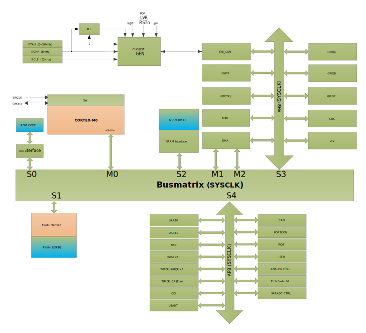

系统架构和存储器描述
=====================

系统架构
---------

SWM221 系统架构如 :numref:`系统架构` 所示。系统总线具有：

-  3个主控总线
   
   -  Cortex M0内核
   
   -  DMA1
   
   -  DMA2

-  5个被控总线
   
   -  ROM Code（系统启动代码）
   
   -  Flash接口
   
   -  SRAM接口
   
   -  AHB总线
   
   -  APB总线

.. _系统架构:

   
   系统架构 
   

总线矩阵
---------

借助总线矩阵，可以实现主控总线到被控总线的访问，这样即使在多个高速外设同时运行期
间，系统也可以实现并发访问和高效运行。此架构如 :numref:`busmatrix`  所示。

.. _busmatrix:

   
   总线矩阵 
   

系统电源概述
---------------

SWM221系列芯片工作电压要求介于2V到3.6V之间。系统电源架构如 :numref:`system_power` 所示

VDDIO提供IO电源。电源地VSS和VSSIO芯片内部短接。

模拟电路电源通过VDD引脚输入，提供电源给PLL, HRC, LRC, ADC, DAC, PGA, CMP, POR, LVR, 以及PVD，并且通过芯片内嵌线性稳压器（LDO）来为内部数字电源提供1.5V电源。

.. important::
   CAP脚位为LDO输出，需要对地接电容，使用高质量电容能提升系统稳定性，有效降低电源干扰。

.. _system_power:

   
   系统电源架构 

存储器映射
----------

.. include:: 存储器映射.rst    

   